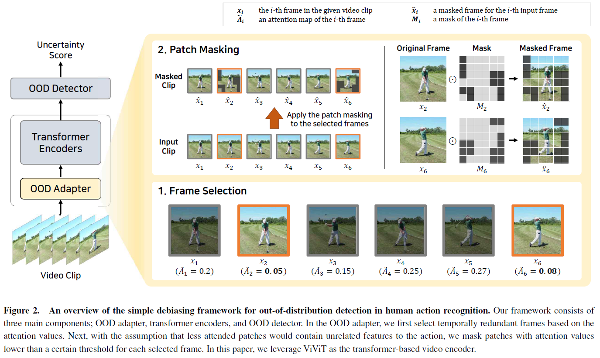

## 📸 Gallery
  

Built an immersive XR drill that converts police manuals into dynamic training scenarios and scores trainee responses in real time.

**Highlights**
- Scene graphs auto‑generated from 300 + SOP pages  
- Auto-generated agents drive hostile NPC behaviour  
- Unity + OpenXR; supports VR, AR and CAVE setups  

  
[Read More](https://www.dt.co.kr/contents.html?article_no=2021072802109923645006)
