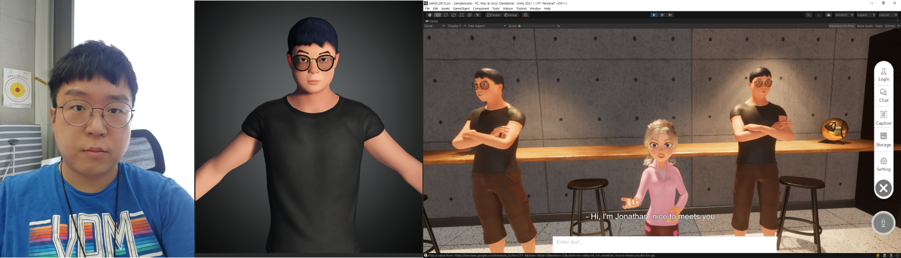

## 📸 Gallery

AILA delivers real‑time English conversation through 3‑D avatars that combine Unity graphics with an AI chatbot back‑end.

**Highlights**
- Full‑body avatar synthesis with lip‑sync and emotion cues  
- Personalized lesson flow driven by GPT‑based dialogue engine  
- WebRTC + WebGL deployment for truly contact‑free learning  

[Read More](https://press.todayan.com/newsRead.php?no=945769)