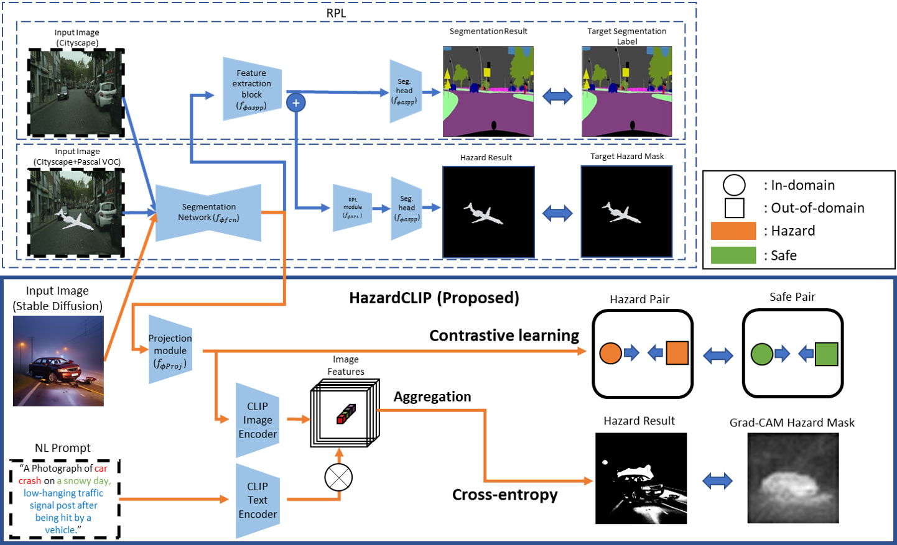
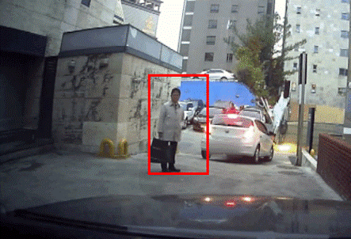

## 📸 Gallery
  

Pixel‑wise logit variance drives a segmentation network that spots debris and potholes while quantifying risk for autonomous vehicles.

**Highlights**
- Uncertainty‑aware segmentation improves average precision by 21.7% 
- Iterative background refinement sharpens hazard edges  
- Bench‑tested on 180 k Korean dash‑cam frames; 45 FPS on RTX A6000  

**Publications**
- *Road anomaly segmentation based on pixel‑wise logit variance with iterative background highlighting*, ICRA 2023
